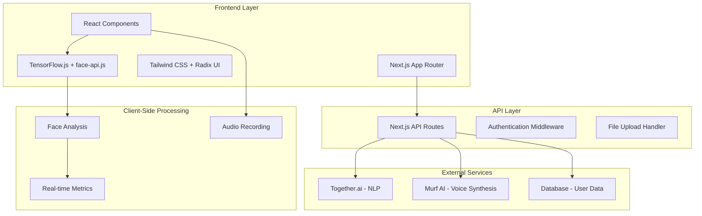

# Design Document

## Overview

AI-Interviewer is a sophisticated web application built with Next.js 14+ using the App Router architecture. The application provides AI-powered mock interview experiences through a modern, responsive interface that serves both candidates and recruiters. The system integrates multiple AI services for voice synthesis, computer vision analysis, and natural language processing to create realistic interview simulations.

## Architecture

### High-Level Architecture



### Technology Stack

**Frontend:**
- Next.js 14+ with App Router for server-side rendering and routing
- React 18+ with TypeScript for type-safe component development
- Tailwind CSS for utility-first styling
- Radix UI for accessible, unstyled UI primitives
- Lucide Icons for consistent iconography

**Backend:**
- Next.js API Routes for serverless backend functionality
- Node.js runtime environment
- Middleware for authentication and request processing

**AI & ML Services:**
- Together.ai for resume parsing and question generation
- Murf AI for real-time voice synthesis
- face-api.js with TensorFlow.js for facial analysis
- Client-side processing for real-time metrics

## Components and Interfaces

### Core Components

#### 1. Dashboard Layout (`/app/dashboard/layout.tsx`)
```typescript
interface DashboardLayoutProps {
  children: React.ReactNode;
  sidebar: React.ReactNode;
}

// Provides main application shell with navigation
```

#### 2. Interview Selection Panel (`/components/interview/InterviewSelector.tsx`)
```typescript
interface InterviewSelectorProps {
  onInterviewerSelect: (interviewer: InterviewerType) => void;
  onTypeSelect: (type: InterviewType) => void;
  selectedInterviewer?: InterviewerType;
  selectedType?: InterviewType;
}

type InterviewerType = 'tech-lead' | 'hr-manager' | 'product-manager' | 'recruiter';
type InterviewType = 'technical' | 'behavioral' | 'case-study';
```

#### 3. Resume Upload Component (`/components/resume/ResumeUpload.tsx`)
```typescript
interface ResumeUploadProps {
  onUploadComplete: (resumeData: ParsedResumeData) => void;
  onUploadError: (error: string) => void;
  acceptedFormats: string[];
}

interface ParsedResumeData {
  skills: string[];
  experience: ExperienceItem[];
  education: EducationItem[];
  projects: ProjectItem[];
  rawText: string;
}
```

#### 4. Customization Panel (`/components/interview/CustomizationPanel.tsx`)
```typescript
interface CustomizationPanelProps {
  onSettingsChange: (settings: InterviewSettings) => void;
  initialSettings?: InterviewSettings;
}

interface InterviewSettings {
  difficulty: 'beginner' | 'moderate' | 'advanced';
  topicFocus: 'dsa' | 'projects' | 'fundamentals' | 'resume' | 'mixed';
  purpose: 'internship' | 'placement' | 'general';
}
```

#### 5. Interview Session Component (`/components/interview/InterviewSession.tsx`)
```typescript
interface InterviewSessionProps {
  interviewConfig: InterviewConfiguration;
  onSessionComplete: (results: InterviewResults) => void;
  onSessionError: (error: string) => void;
}

interface InterviewConfiguration {
  interviewer: InterviewerType;
  type: InterviewType;
  settings: InterviewSettings;
  resumeData?: ParsedResumeData;
  jobPosting?: JobPosting;
}
```

#### 6. Recruiter Dashboard (`/components/recruiter/RecruiterDashboard.tsx`)
```typescript
interface RecruiterDashboardProps {
  recruiterId: string;
  onJobPostCreate: (jobPost: JobPosting) => void;
}

interface JobPosting {
  id: string;
  title: string;
  description: string;
  requiredSkills: string[];
  experienceLevel: string;
  interviewFlow: InterviewFlowConfig;
  recruiterId: string;
  createdAt: Date;
  isActive: boolean;
}
```

#### 7. Job Board Component (`/components/jobs/JobBoard.tsx`)
```typescript
interface JobBoardProps {
  jobs: JobPosting[];
  onJobSelect: (job: JobPosting) => void;
  filters?: JobFilters;
}

interface JobFilters {
  skills?: string[];
  experienceLevel?: string;
  location?: string;
}
```

### API Interfaces

#### 1. Resume Processing API (`/app/api/resume/parse/route.ts`)
```typescript
interface ResumeParseRequest {
  file: File;
  format: 'pdf' | 'docx';
}

interface ResumeParseResponse {
  success: boolean;
  data?: ParsedResumeData;
  error?: string;
}
```

#### 2. Question Generation API (`/app/api/interview/questions/route.ts`)
```typescript
interface QuestionGenerationRequest {
  interviewConfig: InterviewConfiguration;
  resumeData?: ParsedResumeData;
  jobPosting?: JobPosting;
}

interface QuestionGenerationResponse {
  questions: InterviewQuestion[];
  sessionId: string;
}

interface InterviewQuestion {
  id: string;
  text: string;
  type: 'technical' | 'behavioral' | 'case-study';
  difficulty: number;
  expectedDuration: number;
  followUpQuestions?: string[];
}
```

#### 3. Voice Synthesis API (`/app/api/voice/synthesize/route.ts`)
```typescript
interface VoiceSynthesisRequest {
  text: string;
  voice: VoiceProfile;
  speed: number;
}

interface VoiceProfile {
  gender: 'male' | 'female';
  accent: string;
  tone: 'professional' | 'friendly' | 'authoritative';
}
```

## Data Models

### User Models

```typescript
interface User {
  id: string;
  email: string;
  role: 'candidate' | 'recruiter';
  profile: CandidateProfile | RecruiterProfile;
  createdAt: Date;
  updatedAt: Date;
}

interface CandidateProfile {
  firstName: string;
  lastName: string;
  resumeUrl?: string;
  skills: string[];
  experienceLevel: string;
  interviewHistory: InterviewSession[];
}

interface RecruiterProfile {
  companyName: string;
  firstName: string;
  lastName: string;
  jobPostings: JobPosting[];
  interviewReports: InterviewReport[];
}
```

### Interview Models

```typescript
interface InterviewSession {
  id: string;
  candidateId: string;
  jobPostingId?: string;
  configuration: InterviewConfiguration;
  questions: InterviewQuestion[];
  responses: InterviewResponse[];
  metrics: InterviewMetrics;
  feedback: InterviewFeedback;
  status: 'in-progress' | 'completed' | 'abandoned';
  startedAt: Date;
  completedAt?: Date;
}

interface InterviewResponse {
  questionId: string;
  audioUrl?: string;
  transcription: string;
  duration: number;
  confidence: number;
  facialMetrics: FacialAnalysisData;
}

interface InterviewMetrics {
  eyeContactPercentage: number;
  moodTimeline: MoodDataPoint[];
  averageConfidence: number;
  responseQuality: number;
  overallEngagement: number;
}

interface FacialAnalysisData {
  emotions: EmotionScores;
  eyeContact: boolean;
  headPose: HeadPoseData;
  timestamp: number;
}
```

## Error Handling

### Error Categories

1. **Client-Side Errors**
   - Network connectivity issues
   - Browser compatibility problems
   - Media device access failures
   - File upload validation errors

2. **Server-Side Errors**
   - API rate limiting
   - External service failures (Together.ai, Murf AI)
   - Database connection issues
   - Authentication/authorization failures

3. **AI Service Errors**
   - Resume parsing failures
   - Voice synthesis timeouts
   - Question generation errors
   - Face detection failures

### Error Handling Strategy

```typescript
interface ErrorBoundaryState {
  hasError: boolean;
  error?: Error;
  errorInfo?: ErrorInfo;
}

// Global error handling with graceful degradation
class InterviewErrorBoundary extends Component<Props, ErrorBoundaryState> {
  // Implements fallback UI and error reporting
}

// API error handling with retry logic
const apiErrorHandler = {
  handleNetworkError: (error: NetworkError) => void;
  handleServiceError: (error: ServiceError) => void;
  handleValidationError: (error: ValidationError) => void;
};
```

### Graceful Degradation

- **Voice Synthesis Failure**: Fall back to text-based questions
- **Face Detection Failure**: Continue interview without facial metrics
- **Resume Parsing Failure**: Use generic questions
- **Network Issues**: Cache questions locally and sync when connection restored

## Testing Strategy

### Unit Testing
- Component testing with React Testing Library
- API route testing with Jest
- Utility function testing
- Mock external service calls

### Integration Testing
- End-to-end interview flow testing
- File upload and processing workflows
- Authentication and authorization flows
- Database operations

### Performance Testing
- Real-time face analysis performance
- Voice synthesis latency testing
- Large file upload handling
- Concurrent user session management

### Accessibility Testing
- Screen reader compatibility
- Keyboard navigation
- Color contrast compliance
- ARIA label validation

### Testing Tools
```typescript
// Jest configuration for Next.js
const nextJest = require('next/jest');

const createJestConfig = nextJest({
  dir: './',
});

// Playwright for E2E testing
import { test, expect } from '@playwright/test';

// React Testing Library for component tests
import { render, screen, fireEvent } from '@testing-library/react';
```

## Security Considerations

### Data Protection
- Encrypt resume files and interview recordings at rest
- Implement secure file upload with virus scanning
- Use HTTPS for all communications
- Sanitize user inputs to prevent XSS attacks

### Authentication & Authorization
- JWT-based authentication with refresh tokens
- Role-based access control (RBAC)
- Session management with secure cookies
- Rate limiting on API endpoints

### Privacy Compliance
- GDPR-compliant data handling
- User consent management
- Data retention policies
- Right to deletion implementation

## Performance Optimization

### Frontend Optimization
- Code splitting with Next.js dynamic imports
- Image optimization with Next.js Image component
- Lazy loading for non-critical components
- Service worker for offline functionality

### Backend Optimization
- API response caching with Redis
- Database query optimization
- CDN for static assets
- Serverless function optimization

### Real-time Processing
- WebRTC for low-latency audio/video
- WebAssembly for face detection performance
- Efficient data structures for metrics collection
- Background processing for non-critical tasks